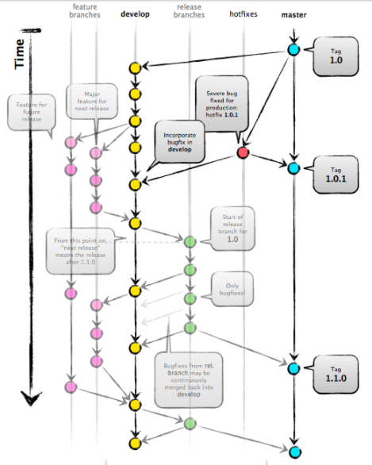
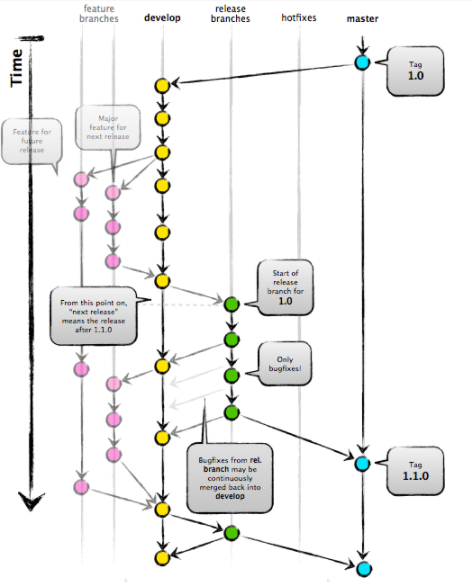
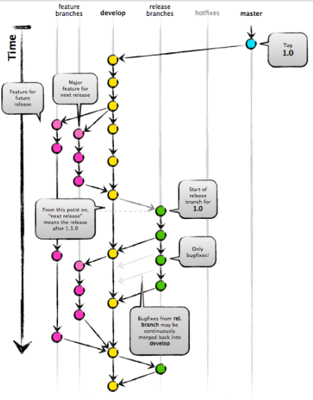
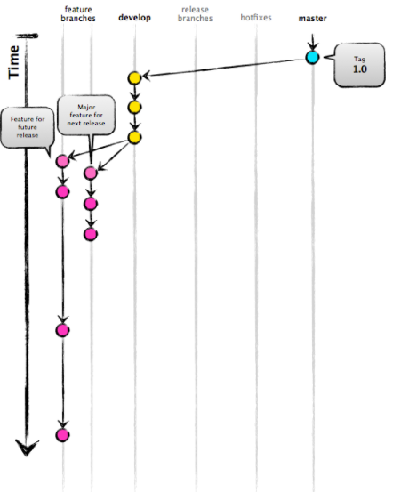

## Git flow explanation

5 types of branches are important to understand inorder to understand the upper level flow of git:

- master

Production source code is directly connected with this branch of code.
So final source code wiht all developed feature planned and tested feature's code will be commited at this level
Only hotfixes and release branches can merge the code to master branch.

- hotfixes

Emergency bugs in the source code on master branch (could be deployed on production level), gets solved from this branch and it can got to develop and then feature branch if required.

- release branches

Any feature once finished developing and are ready according to planned will get pushed into release branch. From this relase branch a feature can go back to development due to failure in testing, so cycle of deploy->test->fix->deploy->retest gos on untill oit reaches the satisfaction level of requirements for release. Once it gets ready for release it merges the code with master.

- Develop & feature branches

Feature branches are branched off of the develop branch, and finished features and fixes are merged back into the develop branch when they’re ready for release. Feature branches will be of developing New features and non-emergency bug fixes.

### Key Benefits

* Parallel Development : 
Differnt developers can take work on different or same feature for the same product with same source code at the same time. 

* Collaboration : 
Multiple developers working on features of particular product, can merge their code and test it on same plateform. Decentralized but centralized.

* Release Staging Area : 
Staging area is collection of developed features which are yet to get released. These process between releasing feature in next release is decided based on multiple parameteres such as - test passed, requirement satisfied, quality of source code etc.

* Support For Emergency Fixes : 
GitFlow supports hotfix branches - only contain your emergency fix. There’s no risk that you’ll accidentally merge in new development at the same time.

**For more Information on Git flow:**

https://datasift.github.io/gitflow/IntroducingGitFlow.html
